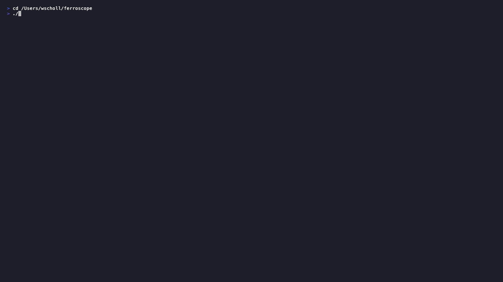

# 🦀 Ferroscope

> **See Rust's power in real time.** 15 live interactive demos covering ownership,
> zero-cost abstractions, fearless concurrency, async I/O, lifetimes, WASM, and more —
> all in a blazing-fast terminal UI. Written in 100% Rust.



---

## Demos

| # | Demo | Level |
|---|------|-------|
| 1 | Ownership & Borrowing | Beginner |
| 2 | Memory Management | Beginner |
| 3 | Zero-Cost Abstractions | Intermediate |
| 4 | Fearless Concurrency | Beginner |
| 5 | Async/Await | Intermediate |
| 6 | Performance Benchmarks | Intermediate |
| 7 | Type System | Intermediate |
| 8 | Error Handling | Intermediate |
| 9 | Lifetimes | Advanced |
| 10 | Unsafe Rust | Advanced |
| 11 | WebAssembly | Intermediate |
| 12 | System Metrics | Intermediate |
| 13 | Compile-Time Guarantees | Intermediate |
| 14 | Cargo Ecosystem | Advanced |
| 15 | Embedded / no_std | Intermediate |

---

## Quick Start

```bash
# Clone
git clone https://github.com/wesleyscholl/ferroscope.git
cd ferroscope

# Build & run (release mode for best performance)
cargo run --release

# Or install globally
cargo install --path .
ferroscope
```

---

## Options

| Flag | Description | Default |
|------|-------------|---------|
| `--fps N` | Tick rate, 5–120 fps | `30` |
| `--tour` | Auto-advance through all 15 demos | off |
| `--screenshot` | Headless text export of every demo | off |
| `--screenshot-dir <path>` | Output directory for screenshot exports | `ferroscope-screenshots` |
| `--version` | Print version and exit | — |

---

## Key Bindings

| Key | Action |
|-----|--------|
| `← / h`, `→ / l` | Previous / Next demo |
| `1`–`9`, `0` | Jump to demo 1–10 |
| `a`, `b`, `c`, `d`, `f` | Jump to demo 11–15 |
| `Space` | Pause / Resume animation |
| `R` | Reset current demo |
| `+` / `-` | Increase / decrease speed |
| `E` | Toggle explanation panel |
| `j` / `↓` | Scroll explanation down |
| `k` / `↑` | Scroll explanation up |
| `V` | Toggle vs-mode (Rust vs C++) |
| `S` | Screenshot (save text export) |
| `?` | Toggle help overlay |
| `Q` / `Esc` | Quit |

---

## Requirements

- Rust 1.70+
- A 256-color terminal (iTerm2, Terminal.app, Alacritty, WezTerm, kitty, etc.)
- Minimum **120 × 34** terminal size recommended

---

## Re-generating the Demo GIF

The demo GIF is produced with [VHS](https://github.com/charmbracelet/vhs):

```bash
brew install vhs          # macOS — also installs ffmpeg + ttyd
cargo build --release
vhs demo.tape             # outputs assets/demo.gif
```

---

## License

MIT — see [LICENSE](LICENSE).
